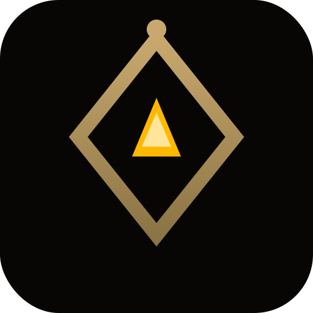

<p align="center">
  <a href="https://kyns.ai">
    
  </a>
  <h1 align="center">
    <a href="https://kyns.ai">KYNS</a>
  </h1>
</p>

<p align="center">
  <strong>Uncensored AI for authentic, unfiltered conversations.</strong><br>
  Self-hostable. Privacy-first. Open-source.
</p>

<p align="center">
  <a href="https://kyns.ai">
    
  </a>
  <a href="https://github.com/Kyns-ai/kyns/blob/main/LICENSE">
    
  </a>
  <a href="https://github.com/Kyns-ai/kyns/stargazers">
    
  </a>
  <a href="https://discord.gg/WJjqmG7b">
    
  </a>
</p>

---

## What is KYNS?

KYNS is an uncensored AI chat platform built for users who want direct, honest AI conversations without the usual corporate guardrails.

- **No filters, no moralizing** — ask anything, get a real answer
- **Privacy-first** — conversations are automatically deleted after 24 hours
- **AI memory** — the AI learns your preferences over time (you can disable this)
- **Image generation** — generate images directly in chat
- **Web search** — real-time information retrieval
- **Role-play characters** — immersive AI personas

Built on top of [LibreChat](https://github.com/danny-avila/LibreChat) — see [NOTICE.md](NOTICE.md) for attribution.

---

## ✨ Features

- 🤖 **Uncensored AI** — powered by fine-tuned open-source models
- 🎨 **Image Generation** — FLUX-based high-quality image creation
- 🔍 **Web Search** — SearXNG + Firecrawl integration
- 🧠 **Persistent Memory** — remembers your preferences across sessions
- 🔒 **Privacy-first** — 24h auto-deletion of conversations and images
- 🎭 **AI Characters** — immersive role-play personas
- 🗣️ **Voice (TTS/STT)** — Chatterbox TTS + Whisper STT
- 📱 **Mobile-friendly** — responsive UI

---

## 🚀 Running Locally

### Prerequisites

- Node.js 20+ 
- MongoDB 6+
- Docker (optional)

### Quick Start with Docker

```bash
git clone https://github.com/Kyns-ai/kyns.git
cd kyns
cp .env.example .env
# Edit .env with your values
docker compose up -d
```

Open `http://localhost:3080`

### Generating Required Secrets

```bash
# CREDS_KEY (64 hex chars)
openssl rand -hex 32

# CREDS_IV (32 hex chars)  
openssl rand -hex 16

# JWT_SECRET
openssl rand -hex 32

# JWT_REFRESH_SECRET
openssl rand -hex 32
```

---

## 🔧 Configuration

Copy `.env.example` to `.env` and fill in the required values:

| Variable | Required | Description |
|---|---|---|
| `MONGO_URI` | Yes | MongoDB connection string |
| `CREDS_KEY` | Yes | AES-256 key for encrypting credentials |
| `CREDS_IV` | Yes | AES IV (16 bytes hex) |
| `JWT_SECRET` | Yes | JWT signing secret |
| `JWT_REFRESH_SECRET` | Yes | JWT refresh signing secret |
| `OPENAI_API_KEY` | Yes | API key for your LLM provider |
| `OPENAI_REVERSE_PROXY` | Yes | vLLM / OpenAI-compatible endpoint URL |

For the full configuration reference, see [`librechat.example.yaml`](librechat.example.yaml) and [`.env.example`](.env.example).

---

## 🤝 Contributing

Contributions are welcome! See [CONTRIBUTING.md](CONTRIBUTING.md) for guidelines.

1. Fork the repo
2. Create a feature branch (`git checkout -b feat/my-feature`)
3. Commit your changes
4. Open a Pull Request

---

## 🔒 Security

Found a vulnerability? See [SECURITY.md](SECURITY.md) for responsible disclosure.

---

## 📄 License

MIT — see [LICENSE](LICENSE).

KYNS™ is a trademark. Forks must remove KYNS branding. See [NOTICE.md](NOTICE.md).

---

## ⭐ Star History

[](https://star-history.com/#Kyns-ai/kyns&Date)

---

Built on [LibreChat](https://github.com/danny-avila/LibreChat) © 2023 Danny Avila — MIT License.
